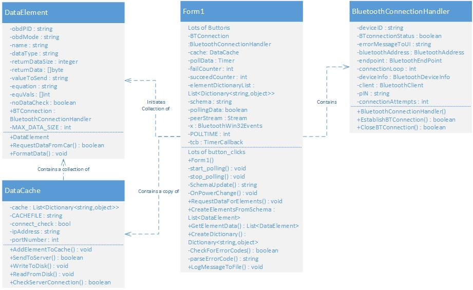
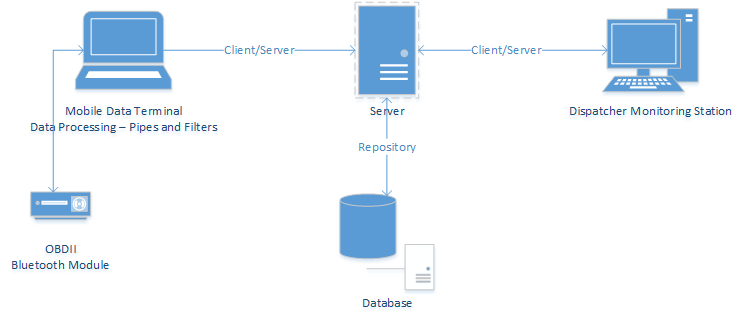

# vConnect (client application)

The vConnect client application is a C# application built with .NET 4.0. It was created by Troy Cosner and Charlie Snyder for their capstone software engineering project at Liberty University in 2015.

###The application utilizes the following external libraries:
  * [32feet.NET][1] (Bluetooth Library)
  * [NCalc][2] (Mathematical Expressions Evaluator)
  * [Json.NET][3] (JSON framework for .NET)
  
The application was developed to run on a **Windows 7** or **Windows 8** laptop using **Microsoft's Bluetooth Stack**. Outside of these requirements, the application may fail.
Consult [32feet.Net][4]'s documentation for more information.  
  
### Installation
vConnect contains an installer that installs the vConnect application, a monitor application, and its required files in a directory. 

  1. Insert OBDLink LX module into the vehicle's OBDII port located underneath the driver-side dash board.
  2. On Windows laptop, go to Control Panel -> Hardware and Sound -> Devices and Printers.
  3. On the OBDLink LX module, press the BT Pair Button, located on the face of the module.
  4. Click Add a device in the Devices and Printers window. 
  5. Select OBDLink LX, and click the Next Button. (Note that the OBDLink LX module will only be discoverable for two minutes after pressing the BT Pair Button. If your laptop does not detect the device, press the BT Pair Button again)
  6. A window will be displayed with a PIN for the OBDLink LX module. Record this number and click the connect button.
  7. Run vConnect.exe.
  8. Click through the message boxes stating ___
  9. Double click on the vConnect Icon (check mark) located in the Windows tool bar to open the vConnect UI.
  10. Click the Set Pin Button.
  11. Enter the VIN you recorded in step 7, and click OK.
  12. Click the Select OBDII Device Button.
  13. Select the OBDLink LX module, and click the Next Button. The Device Status Label should change to "Connected", and the Bluetooth Device ID should read OBDLink LX.
  14. Click the Update Schema Button.
  15. Click the Configure Server Address Button.
  16. Enter the address of the server that vConnect's database is being stored on, and click the OK Button. (vconnect-danieladams456.rhcloud.com)
  17. Click the Configure Port Button.
  18. Enter the port number of the database server to be using to connect, and click the OK Button. (Port 80) 
  19. Click the Start Button.
 
If Configured correct, the Polling status will read "Polling", and the Server Status will "Connected" if the laptop currently has internet access. 
 
 ### Usage
After installation, execute vConnect.exe.

The latest version of vConnect utilizes a Monitor application in order to ensure that the application continues to run. Whenever any situations cause the program to terminate, the monitor will restart it and begin polling for data.

### Code Structure

### Architecture

### Data Elements Currently Implemented
| Element Name | Description | Unit |
| ------------ | ----------- | ---- |
| VIN | Vehicle Identification Number | Characters |
| vehicle_speed | Current Speed of Vehicle | km/h |
| engine_rpm | Current RPM of Vehicle | rpm |
| run_time_since_start | Time Engine Has Been Running | seconds |
| fuel_level | Percent of Tank Full | percent |
| oil_temp | Engine Oil Temperature | degrees Celsius |
| accel_pos | Relative Accelerator Position | Percent |
| dist_with_MIL | Distance Driven With Check-Engine Light On | km |
note: The data elements used are specified in the JSON schema on the web server.  
  
[1]: https://32feet.codeplex.com/
[2]: https://ncalc.codeplex.com/
[3]: http://www.newtonsoft.com/json
[4]: https://32feet.codeplex.com/wikipage?title=Supported%20Hardware%20and%20Software